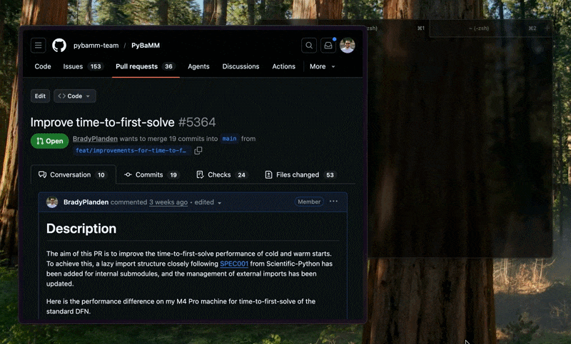

<p align="center">
    
</p>

<p align="center">
  
</p>

## The problem

Reviewing a PR can require the following repetitive setup:

- Locate (or clone) the repo
- Stash any local changes
- Determine the corresponding branch name
- Create a worktree or checkout the branch
- Initialise submodules, fetch the default branch, etc.
- Start reviewing

`prt` compresses that into one command by handling those steps automatically:

```bash
prt https://github.com/OWNER/REPO/pull/123
```

which completes the above efficiently and opens a new terminal tab in the configured state.

## Requirements

- `git`
- `gh` (GitHub CLI, authenticated)
- macOS with iTerm2 or Terminal.app for tab opening (other OSes print the path)

## Install

```bash
go install github.com/BradyPlanden/prt/cmd/prt@latest
```

Homebrew tap:

```bash
brew tap BradyPlanden/prt https://github.com/BradyPlanden/prt
brew install BradyPlanden/prt/prt
```

Install the specific version's:

```bash
brew install BradyPlanden/prt/prt@0.1
```

specific versions are keg-only. Run them directly:

```bash
$(brew --prefix)/opt/prt@0.1/bin/prt --version
```

Or make it your active `prt`:

```bash
brew unlink prt
brew link --force prt@0.1
```

Note: tap installs are pinned to tagged releases and build from source.

## Usage

```bash
prt https://github.com/OWNER/REPO/pull/123
prt https://github.com/OWNER/REPO/pull/123 --temp
prt https://github.com/OWNER/REPO/pull/123 --no-tab
prt https://github.com/OWNER/REPO/pull/123 --terminal iterm2
prt clean --dry-run
prt clean --all
```

## Shell completion

Generate shell completion scripts:

```bash
# bash
prt completion bash > /etc/bash_completion.d/prt

# zsh
prt completion zsh > "${fpath[1]}/_prt"

# fish
prt completion fish > ~/.config/fish/completions/prt.fish
```

## Config

Create `~/.config/prt/config.yaml`:

```yaml
projects_dir: ~/Projects
temp_dir: /tmp/prt
temp_ttl: 24h
terminal: auto # auto | iterm2 | terminal
```

Configuration precedence (lowest to highest): config file, environment variables, CLI flags.

Notes:

- `PRT_TEMP_TTL`, `temp_ttl` in config, and `--temp-ttl` all fail with an error when given an invalid duration.
- `PRT_VERBOSE` accepts `1`, `true`, `yes`, or `on`.

## URL host support

- `prt` accepts PR URLs from `github.com` and `*.github.com` hosts.

## Terminal behavior

- On macOS, `terminal: auto` detects from `TERM_PROGRAM` and opens a new tab only when launched from iTerm2 (`iTerm.app`) or Terminal.app (`Apple_Terminal`).
- If auto detection cannot identify either app, `prt` prints the resolved path instead.
- Use `--terminal` or `PRT_TERMINAL` to force `iterm2` or `terminal` when needed.

## Features

- **Upstream tracking**: The local branch is set to track the remote PR branch, so `git pull`/`git push` work out of the box.
- **Fork remotes**: For cross-repo (fork) PRs, a remote named `prt/<owner>/<repo>` is added pointing to the fork. Existing remote URLs are never overwritten — if you've configured SSH or custom URL rewriting, your settings are preserved.
- **Per-worktree push config**: Cross-repo worktrees get `push.default=upstream` scoped to the worktree, so pushes go to the correct fork branch without affecting other worktrees.
- **Stale branch recovery**: If a local branch exists from a previous worktree that was manually removed, `prt` automatically resets it rather than failing.
- **Offline resilience**: When reusing an existing worktree, fetch failures produce a warning instead of blocking access to the local checkout.

Environment overrides:

- `PRT_PROJECTS_DIR` (default `~/Projects`)
- `PRT_TEMP_DIR` (default `/tmp/prt`)
- `PRT_TEMP_TTL` (default `24h`)
- `PRT_TERMINAL` (default `auto`; `auto | iterm2 | terminal`)
- `PRT_VERBOSE` (set to `1` to enable verbose logging)
